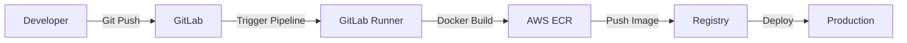

# Food Ordering System (Sar Mel)

This repository contains a full-stack Food Ordering System built with React and FastAPI. It serves as a practical example of a GitLab CI/CD pipeline that automatically builds Docker images, pushes them to Amazon ECR, and deploys them to Kubernetes. The project demonstrates containerized application development, image delivery workflows, registry authentication, and Kubernetes deployment in a real-world DevOps environment.

## 1. Project Overview

The Food Ordering System is a comprehensive platform that connects restaurants with customers. It provides a seamless experience for browsing menus, placing orders, and managing restaurant operations.

### Key Features:
- **User Authentication:** Secure login and registration for Customers, Restaurant Owners, and Admins.
- **Restaurant Management:** Owners can manage their restaurant profiles, menus, and categories.
- **Order Management:** Real-time order tracking and history for customers.
- **Admin Dashboard:** Centralized control for managing users, restaurants, and system-wide settings.
- **Notifications:** Built-in notification system for order updates and alerts.
- **Reviews & Ratings:** Integrated feedback loop for customers to review menu items and restaurants.

---

## 2. Technology Stack

### Backend
- **Framework:** [FastAPI](https://fastapi.tiangolo.com/) (Python 3.11)
- **ORM:** [SQLAlchemy](https://www.sqlalchemy.org/)
- **Migrations:** [Alembic](https://alembic.sqlalchemy.org/)
- **Validation:** [Pydantic v2](https://docs.pydantic.dev/)
- **Security:** JOSE (JWT), Passlib (Bcrypt)

### Frontend
- **Framework:** [React 19](https://react.dev/)
- **Build Tool:** [Vite](https://vitejs.dev/)
- **Icons:** [Lucide React](https://lucide.dev/)
- **Styling:** Vanilla CSS (Modern CSS features)

### Database
- **Primary:** [PostgreSQL 15](https://www.postgresql.org/)

### Infrastructure & DevOps
- **Containerization:** Docker, Docker Compose
- **CI/CD:** GitLab CI/CD
- **Cloud Provider:** AWS (ECR, EC2)
- **Container Registry:** Amazon ECR

---

## 3. Project Structure

```text
/sar-mel
├── backend/                # FastAPI Application
│   ├── app/                # Core application logic
│   │   ├── api/            # API Endpoints (v1)
│   │   ├── core/           # Config and Security
│   │   ├── crud/           # Database operations
│   │   ├── models/         # SQLAlchemy models
│   │   └── schemas/        # Pydantic schemas
│   ├── alembic/            # DB Migration scripts
│   ├── Dockerfile          # Backend container definition
│   └── requirements.txt    # Python dependencies
├── frontend/               # React Application
│   ├── src/                # Source code
│   │   ├── api/            # API client
│   │   ├── components/     # Reusable UI components
│   │   └── utils/          # Helper functions
│   ├── Dockerfile          # Frontend container (Multi-stage)
│   └── package.json        # JS dependencies
├── docker-compose.yml      # Local orchestration
└── .gitlab-ci.yml          # CI/CD Pipeline definition
```

---

## 4. Local Development Setup

### Prerequisites
- [Docker & Docker Compose](https://docs.docker.com/get-docker/)
- [Git](https://git-scm.com/)

### Step 1: Clone the Repository
```bash
git clone <repository-url>
cd sar-mel
```

### Step 2: Configure Environment Variables
Create a `.env` file in the `backend/` directory:
```bash
cp backend/.env.example backend/.env
```
Update the `.env` with your local database credentials and secret keys.

To generate the secret key
```bash
python -c "import secrets; print(secrets.token_urlsafe(32))"
```

Or

```bash
openssl rand -hex 32
```

### Step 3: Start the Application
Run the following command in the root directory:
```bash
docker-compose up --build
```
And run to create tables
```bash
docker-compose exec backend alembic upgrade head
```

### Step 4: Verify Services
- **Frontend:** [http://localhost:5173](http://localhost:5173)
- **Backend API:** [http://localhost:8000/api/v1](http://localhost:8000/api/v1)
- **API Docs (Swagger):** [http://localhost:8000/docs](http://localhost:8000/docs)

---

## 5. Docker Setup

### Backend Dockerfile
Uses `python:3.11-slim` for a small footprint. It installs dependencies via `pip` and runs the FastAPI application using `uvicorn`.

### Frontend Dockerfile
Implements a **multi-stage build**:
1. **Build Stage:** Uses `node:20-alpine` to compile the React application.
2. **Runtime Stage:** Uses `nginx:1.27-alpine` to serve the static assets. Runs as a non-root user on port 8080 for enhanced security.

### Docker Compose
Orchestrates three services:
- `db`: PostgreSQL 15 database.
- `web`: FastAPI backend with hot-reload enabled.
- `frontend`: Vite-based React frontend.

---

## 6. CI/CD Pipeline

The project uses GitLab CI/CD for automated testing and deployment.

### Pipeline Stages:
1. **Login:** Authenticates with Amazon ECR using the AWS CLI.
2. **Build:** Builds Docker images for both frontend and backend using `buildkit` for efficient caching and parallel builds.

### Image Tagging Strategy:
- Images are tagged as `latest` for the `main` branch.
- Registry format: `${ECR_REGISTRY}/${IMAGE_NAME}:${TAG}`

---

## 7. GitLab Runner Setup

### Approach A: Docker-based GitLab Runner
Ideal for general purpose CI/CD.

1. **Install Docker:**
   ```bash
   sudo apt-get update
   sudo apt-get install docker.io
   ```
2. **Install GitLab Runner:**
   ```bash
   sudo curl -L --output /usr/local/bin/gitlab-runner https://gitlab-runner-downloads.s3.amazonaws.com/latest/binaries/gitlab-runner-linux-amd64
   sudo chmod +x /usr/local/bin/gitlab-runner
   ```
3. **Register Runner:**
   ```bash
   sudo gitlab-runner register \
     --url https://gitlab.com/ \
     --registration-token <YOUR_TOKEN> \
     --executor docker \
     --docker-image docker:latest
   ```

### Approach B: AWS EC2-based GitLab Runner
Recommended for performance and direct AWS resource access.

1. **Launch Instance:** Create an Ubuntu EC2 instance with an appropriate IAM Role.
2. **Install Docker & Runner:** Follow the same steps as Approach A.
3. **Register with Tags:** Use a specific tag (e.g., `aws-runner`) to target AWS-specific jobs.
4. **Security Groups:** Ensure the instance can communicate with GitLab (outbound HTTPS).

---

## 8. AWS ECR Setup

1. **Create Repository:**
   Go to AWS Console -> ECR -> Create repository. Create one for `sar-mel-backend` and one for `sar-mel-frontend`.
2. **Naming Convention:**
   `account_id.dkr.ecr.region.amazonaws.com/project-name-service-name`
3. **Authentication:**
   CI/CD uses `aws ecr get-login-password` to generate a temporary token for Docker login.

---

## 9. IAM User and Permissions for ECR

### 1. Create IAM User
Create a user named `gitlab-ci-user` with `Programmatic access`.

### 2. Generate Credentials
Save the `Access Key ID` and `Secret Access Key`.

### 3. Required Policy
Attach the following inline policy to the user:
```json
{
    "Version": "2012-10-17",
    "Statement": [
        {
            "Effect": "Allow",
            "Action": [
                "ecr:GetAuthorizationToken",
                "ecr:BatchCheckLayerAvailability",
                "ecr:GetDownloadUrlForLayer",
                "ecr:GetRepositoryPolicy",
                "ecr:DescribeRepositories",
                "ecr:ListImages",
                "ecr:DescribeImages",
                "ecr:BatchGetImage",
                "ecr:InitiateLayerUpload",
                "ecr:UploadLayerPart",
                "ecr:CompleteLayerUpload",
                "ecr:PutImage"
            ],
            "Resource": "*"
        }
    ]
}
```

### 4. Store Variables in GitLab
Go to **Settings > CI/CD > Variables**:
- `AWS_ACCESS_KEY_ID`: Your access key.
- `AWS_SECRET_ACCESS_KEY`: Your secret key.
- `AWS_DEFAULT_REGION`: e.g., `us-east-1`.
- `ECR_REGISTRY`: Your AWS account registry URL.

---

## 10. Deployment Flow



1. **Push:** Developer pushes code to `main`.
2. **Pipeline:** GitLab triggers the `.gitlab-ci.yml` workflow.
3. **Runner:** A GitLab Runner picks up the job.
4. **Build:** Docker images are built and optimized using Buildkit.
5. **ECR:** Images are pushed to Amazon ECR.
6. **Deploy:** The target environment pulls the new images and restarts services.

---

## 11. Troubleshooting

| Issue | Solution |
| :--- | :--- |
| **Docker Permission Denied** | Add your user to the `docker` group: `sudo usermod -aG docker $USER`. |
| **ECR Login Failure** | Check if `AWS_ACCESS_KEY_ID` and `AWS_SECRET_ACCESS_KEY` are correctly set in GitLab. |
| **Runner Offline** | Restart the service: `sudo gitlab-runner restart`. |
| **TLS/Certificate Errors** | Ensure the Runner has the correct `SSL_CERT_DIR` configured or the host has updated CA certificates. |
| **Image Push Fail** | Verify that the ECR repository exists and the IAM policy allows `ecr:PutImage`. |

---


